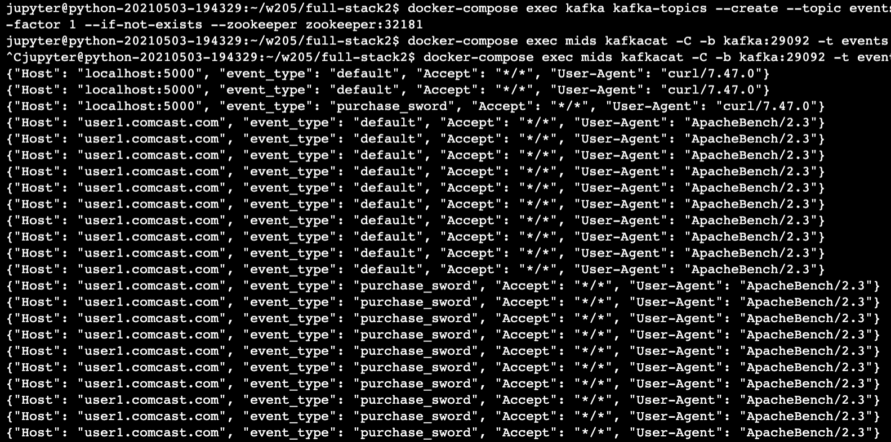
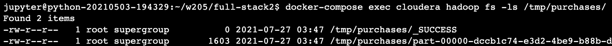
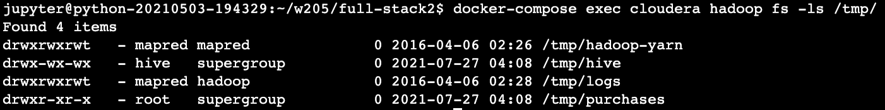
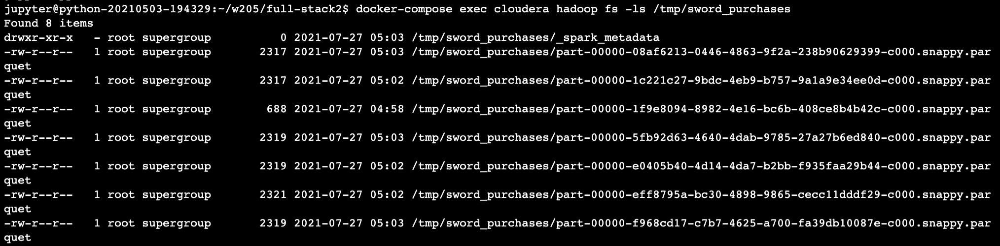
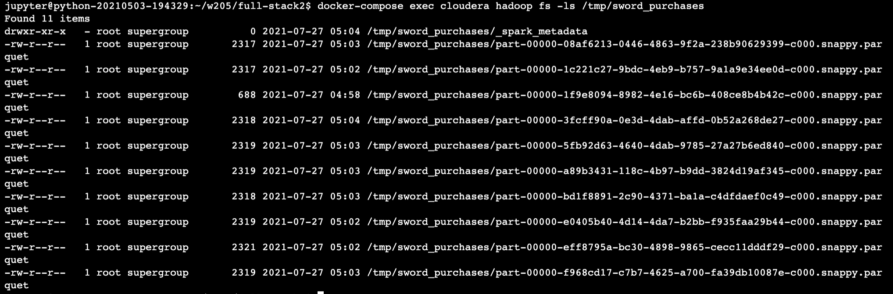
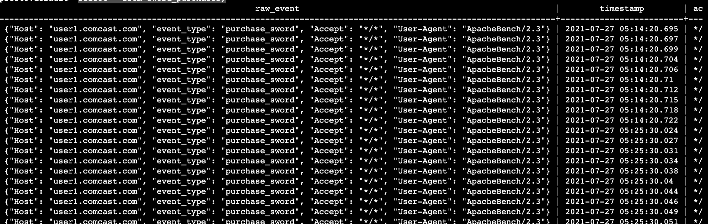

# Data Engineering: Week 13 Notes

Will be learning Flask-Kafka-Spark-Hadoop-Presto Part II

<br><br><br><br><br>

Docker compose file has 6 images running. 

<details>
    <summary>Docker compose</summary>

```bash
---
version: '2'
services:
  zookeeper:
    image: confluentinc/cp-zookeeper:latest
    environment:
      ZOOKEEPER_CLIENT_PORT: 32181
      ZOOKEEPER_TICK_TIME: 2000
    expose:
      - "2181"
      - "2888"
      - "32181"
      - "3888"
    extra_hosts:
      - "moby:127.0.0.1"

  kafka:
    image: confluentinc/cp-kafka:latest
    depends_on:
      - zookeeper
    environment:
      KAFKA_BROKER_ID: 1
      KAFKA_ZOOKEEPER_CONNECT: zookeeper:32181
      KAFKA_ADVERTISED_LISTENERS: PLAINTEXT://kafka:29092
      KAFKA_OFFSETS_TOPIC_REPLICATION_FACTOR: 1
    expose:
      - "9092"
      - "29092"
    extra_hosts:
      - "moby:127.0.0.1"

  cloudera:
    image: midsw205/hadoop:0.0.2
    hostname: cloudera
    expose:
      - "8020" # nn
      - "8888" # hue
      - "9083" # hive thrift
      - "10000" # hive jdbc
      - "50070" # nn http
    ports:
      - "8888:8888"
    extra_hosts:
      - "moby:127.0.0.1"

  spark:
    image: midsw205/spark-python:0.0.6
    stdin_open: true
    tty: true
    volumes:
      - ~/w205:/w205
    expose:
      - "8888"
    #ports:
    #  - "8888:8888"
    depends_on:
      - cloudera
    environment:
      HADOOP_NAMENODE: cloudera
      HIVE_THRIFTSERVER: cloudera:9083
    extra_hosts:
      - "moby:127.0.0.1"
    command: bash

  presto:
    image: midsw205/presto:0.0.1
    hostname: presto
    volumes:
      - ~/w205:/w205
    expose:
      - "8080"
    environment:
      HIVE_THRIFTSERVER: cloudera:9083
    extra_hosts:
      - "moby:127.0.0.1"

  mids:
    image: midsw205/base:0.1.9
    stdin_open: true
    tty: true
    volumes:
      - ~/w205:/w205
    expose:
      - "5000"
    ports:
      - "5000:5000"
    extra_hosts:
      - "moby:127.0.0.1"
```

</details>

Focusing on steps of spark writing to storage, and then using Presto to query the events. 

<br><br><br><br><br>

# Steps

To start, we are using a new hive program in the cloudera portion of the docker-compose. So I had to fix stuff:

Go back to the GCP page, like where you see all your instances and stuff. Hamburger -> Compute Engine -> VM Instances -> Find your instance. Click on the SSH drop down on the right -> Open in browser window. You'll see a new shell, and type these commands:

```bash
sudo -s
echo 'GRUB_CMDLINE_LINUX_DEFAULT="vsyscall=emulate"' >> /etc/default/grub
update-grub
reboot
```

Then re-start everything and open the jupyterlab and start over. 

Going through normal setups

```bash
# set up folder
cd ~/w203/full-stack2

# copy docker-compose file
cp ~/w205/course-content/13-Understanding-Data/docker-compose.yml .

# copy all python files
cp ~/w205/course-content/13-Understanding-Data/*.py .

# spin up docker
docker-compose up -d

# create topic
docker-compose exec kafka kafka-topics --create --topic events --partitions 1 --replication-factor 1 --if-not-exists --zookeeper zookeeper:32181

# run flask. This ocupies terminal, so open a new one. 
docker-compose exec mids env FLASK_APP=/w205/full-stack2/game_api.py flask run --host 0.0.0.0

# watch kafka. This will capture all messages in the terminal. so open a new one. 
docker-compose exec mids kafkacat -C -b kafka:29092 -t events -o beginning

# generate data
# single events
docker-compose exec mids curl http://localhost:5000/
docker-compose exec mids curl http://localhost:5000/purchase_a_sword
# apache bench
docker-compose exec mids ab -n 10 -H "Host: user1.comcast.com" http://localhost:5000/
docker-compose exec mids ab -n 10 -H "Host: user1.comcast.com" http://localhost:5000/purchase_a_sword
```

<br><br><br><br><br>

Here is the game_api.py file we ran.

<details>
  <summary>game_api.py</summary>


```py
#!/usr/bin/env python
import json
from kafka import KafkaProducer
from flask import Flask, request

app = Flask(__name__)
producer = KafkaProducer(bootstrap_servers='kafka:29092')


def log_to_kafka(topic, event):
    event.update(request.headers)
    producer.send(topic, json.dumps(event).encode())


@app.route("/")
def default_response():
    default_event = {'event_type': 'default'}
    log_to_kafka('events', default_event)
    return "This is the default response!\n"


@app.route("/purchase_a_sword")
def purchase_a_sword():
    purchase_sword_event = {'event_type': 'purchase_sword'}
    log_to_kafka('events', purchase_sword_event)
    return "Sword Purchased!\n"
```

</details>

<br>

The terminal where you wrote the kafka cat command, should be looking like this and getting longer as events are generated:



<br><br><br><br><br>

Now we will run the filtered_writes file. Here is the command to run, and the file below. This is nothing new. It performs a one time spark read from kafka from `events` topic, filters the events on a specific type, then sends the data to hdfs.

Need to run this everytime you have new data in kafka. It is not a stream <i>yet</i>.

```bash
docker-compose exec spark spark-submit /w205/full-stack2/filtered_writes.py
```

<details>
  <summary>filtered_writes.py</summary>

```python
#!/usr/bin/env python
"""Extract events from kafka and write them to hdfs
"""
import json
from pyspark.sql import SparkSession, Row
from pyspark.sql.functions import udf


@udf('boolean')
def is_purchase(event_as_json):
    event = json.loads(event_as_json)
    if event['event_type'] == 'purchase_sword':
        return True
    return False


def main():
    """main
    """
    spark = SparkSession \
        .builder \
        .appName("ExtractEventsJob") \
        .getOrCreate()

    raw_events = spark \
    # If this ever uses .read(), it means it's a one time job.
    # Need to change this if we want it to be a true streaming
    # design. Make sure our spark submit job is complete
    # before making the change. 
        .read \
        .format("kafka") \
        .option("kafka.bootstrap.servers", "kafka:29092") \
        .option("subscribe", "events") \
        .option("startingOffsets", "earliest") \
        .option("endingOffsets", "latest") \
        .load()

    purchase_events = raw_events \
        .select(raw_events.value.cast('string').alias('raw'),
                raw_events.timestamp.cast('string')) \
        .filter(is_purchase('raw'))

    extracted_purchase_events = purchase_events \
        .rdd \
        .map(lambda r: Row(timestamp=r.timestamp, **json.loads(r.raw))) \
        .toDF()
    extracted_purchase_events.printSchema()
    extracted_purchase_events.show()

    extracted_purchase_events \
        .write \
        .mode('overwrite') \
        .parquet('/tmp/purchases')


if __name__ == "__main__":
    main()

```

</details>

Now your data should be in HDFS. Let's check to make sure it's there.

```bash
docker-compose exec cloudera hadoop fs -ls /tmp/purchases/
```

It <i>should</i> look like this:



<br><br><br><br><br>

Okay now let's talk hive metastore

Hive metastore: A place to see all your schema implementations. You can track schema, and create a table. 

Hive is a full on query engine. But, it's slow. So we'll just use the query register. To "expose" the schema for our purchases, we need to create a table. Two ways to create it: (1) run hive explicitly and create the new table, or (2) do it in spark. 

Shiraz: The hard-way is the first way. This code is 7 years old and no one does it anymore this way. We do all our work in spark. I mean you could do it in hive like this, but no one does. (I won't even put the code).

Easier way. So here is how we do it in spark. Basically, we gotta put the code below into our python script. 

```py
df = spark.read.parquet('/tmp/purchases')
df.registerTempTable('purchases')
query = """
create external table purchase_events
  stored as parquet
  location '/tmp/purchase_events'
  as
  select * from purchases
"""
spark.sql(query)
```

Put this at the bottom of the spark submit job. This creates more tables. just change the location of the parquet file. If the parquet file changes, so does the table! Want to design this once and let it run. But it won't run until our spark submit job is a dynamic stream. (Need to change that .read() statement)

```python
df = spark.read.parquet('/tmp/purchases') # read the parquet file from whatever we wrote in hdfs.
df.registerTempTable('purchases') # register a temporary table
query = """
create external table purchase_events
  stored as parquet
  location '/tmp/purchase_events'
  as
  select * from purchases
"""
spark.sql(query)
# then here's a spark sql query for us. 
```

Then when you run it, additional rows should be added to your hive table dynamically. With the first python code above with the .read() statement, our hive table will only update once we re-run the script.

Exercise, get to the spark. 

<br><br><br><br><br>

Turn it into a stream. Here we modified filtered_events file. Call it write_hive_table.py

<details>
  <summary>write_hive_table.py</summary>

```py
#!/usr/bin/env python
"""Extract events from kafka and write them to hdfs
"""
import json
from pyspark.sql import SparkSession, Row
from pyspark.sql.functions import udf


@udf('boolean')
def is_purchase(event_as_json):
    event = json.loads(event_as_json)
    if event['event_type'] == 'purchase_sword':
        return True
    return False


def main():
    """main
    """
    spark = SparkSession \
        .builder \
        .appName("ExtractEventsJob") \
        # added this line
        .enableHiveSupport() \ 
        .getOrCreate()

    raw_events = spark \
        .read \
        .format("kafka") \
        .option("kafka.bootstrap.servers", "kafka:29092") \
        .option("subscribe", "events") \
        .option("startingOffsets", "earliest") \
        .option("endingOffsets", "latest") \
        .load()

    purchase_events = raw_events \
        .select(raw_events.value.cast('string').alias('raw'),
                raw_events.timestamp.cast('string')) \
        .filter(is_purchase('raw'))

    extracted_purchase_events = purchase_events \
        .rdd \
        .map(lambda r: Row(timestamp=r.timestamp, **json.loads(r.raw))) \
        .toDF()
    extracted_purchase_events.printSchema()
    extracted_purchase_events.show()

    # changed this to register a temp table
    extracted_purchase_events.registerTempTable("extracted_purchase_events")

    # adding this spark.sql query like we explained above. 
    spark.sql("""
        create external table purchases
        stored as parquet
        location '/tmp/purchases'
        as
        select * from extracted_purchase_events
    """)


if __name__ == "__main__":
    main()

```
</details>

Run it

```
docker-compose exec spark spark-submit /w205/full-stack2/write_hive_table.py
```

Make sure it wrote to HDFS properly

```bash
docker-compose exec cloudera hadoop fs -ls /tmp/
```

Should give output like this:



<br><br><br><br><br>

# Presto!

Presto is just a query engine. It talks to the "hive thrift server" to get that table we just added. I guess we query with Presto instead of Spark b/c of several reasons:

- Presto scales well
- Has more sql syntax
- We can treat it more like an actual database with it
- It can talk to cassandra, s3 directly, kafka, mysql
- It's a good front end for your company's datalake 

Run presto. This will make your terminal now show this: `presto:default>`. 

```bash
docker-compose exec presto presto --server presto:8080 --catalog hive --schema default
```

See what tables we have in Presto.

```bash
show tables;

# output:
   Table   
-----------
 purchases 
(1 row)

Query 20210727_041614_00002_xn23q, FINISHED, 1 node
Splits: 2 total, 0 done (0.00%)
0:00 [0 rows, 0B] [0 rows/s, 0B/s]
```

Describe it

```bash
presto:default> describe purchases;

# output
   Column   |  Type   | Comment 
------------+---------+---------
 accept     | varchar |         
 host       | varchar |         
 user-agent | varchar |         
 event_type | varchar |         
 timestamp  | varchar |         
(5 rows)

Query 20210727_041720_00003_xn23q, FINISHED, 1 node
Splits: 2 total, 0 done (0.00%)
0:00 [0 rows, 0B] [0 rows/s, 0B/s]
```

Try out a query!

```bash
presto:default> select * from purchases;

# output
 accept |       host        |   user-agent    |   event_type   |        timestamp        
--------+-------------------+-----------------+----------------+-------------------------
 */*    | localhost:5000    | curl/7.47.0     | purchase_sword | 2021-07-27 03:33:59.799 
 */*    | user1.comcast.com | ApacheBench/2.3 | purchase_sword | 2021-07-27 03:35:49.172 
 */*    | user1.comcast.com | ApacheBench/2.3 | purchase_sword | 2021-07-27 03:35:49.177 
 */*    | user1.comcast.com | ApacheBench/2.3 | purchase_sword | 2021-07-27 03:35:49.18  
 */*    | user1.comcast.com | ApacheBench/2.3 | purchase_sword | 2021-07-27 03:35:49.185 
 */*    | user1.comcast.com | ApacheBench/2.3 | purchase_sword | 2021-07-27 03:35:49.187 
 */*    | user1.comcast.com | ApacheBench/2.3 | purchase_sword | 2021-07-27 03:35:49.191 
 */*    | user1.comcast.com | ApacheBench/2.3 | purchase_sword | 2021-07-27 03:35:49.195 
 */*    | user1.comcast.com | ApacheBench/2.3 | purchase_sword | 2021-07-27 03:35:49.198 
 */*    | user1.comcast.com | ApacheBench/2.3 | purchase_sword | 2021-07-27 03:35:49.199 
 */*    | user1.comcast.com | ApacheBench/2.3 | purchase_sword | 2021-07-27 03:35:49.201 
(11 rows)

Query 20210727_041822_00004_xn23q, FINISHED, 1 node
Splits: 2 total, 0 done (0.00%)
0:02 [0 rows, 0B] [0 rows/s, 0B/s]
```

<br><br><br><br><br>

# Streaming


Ok this file is still NOT streaming. But almost.

<details>
  <summary>filter_swords_batch.py</summary>

```py

#!/usr/bin/env python
"""Extract events from kafka and write them to hdfs
"""
import json
from pyspark.sql import SparkSession
from pyspark.sql.functions import udf, from_json
from pyspark.sql.types import StructType, StructField, StringType


def purchase_sword_event_schema():
    """
    root
    |-- Accept: string (nullable = true)
    |-- Host: string (nullable = true)
    |-- User-Agent: string (nullable = true)
    |-- event_type: string (nullable = true)
    |-- timestamp: string (nullable = true)
    """
    return StructType([
        StructField("Accept", StringType(), True),
        StructField("Host", StringType(), True),
        StructField("User-Agent", StringType(), True),
        StructField("event_type", StringType(), True),
    ])


@udf('boolean')
def is_sword_purchase(event_as_json):
    """udf for filtering events
    """
    event = json.loads(event_as_json)
    if event['event_type'] == 'purchase_sword':
        return True
    return False


def main():
    """main
    """
    spark = SparkSession \
        .builder \
        .appName("ExtractEventsJob") \
        .getOrCreate()

    raw_events = spark \
        .read \
        .format("kafka") \
        .option("kafka.bootstrap.servers", "kafka:29092") \
        .option("subscribe", "events") \
        .option("startingOffsets", "earliest") \
        .option("endingOffsets", "latest") \
        .load()

    sword_purchases = raw_events \
        .filter(is_sword_purchase(raw_events.value.cast('string'))) \
        .select(raw_events.value.cast('string').alias('raw_event'),
                raw_events.timestamp.cast('string'),
                from_json(raw_events.value.cast('string'),
                          purchase_sword_event_schema()).alias('json')) \
        .select('raw_event', 'timestamp', 'json.*')

    sword_purchases.printSchema()
    sword_purchases.show(100)


if __name__ == "__main__":
    main()
```

</details>

I guess this just speicifally sets the schema. So run this 


```bash
docker-compose exec spark spark-submit /w205/full-stack2/filter_swords_batch.py
```

<br><br><br><br><br>

Finally, we turn this file into a steam.

<details>
  <summary>filter_swords_stream.py</summary>

```py
#!/usr/bin/env python
"""Extract events from kafka and write them to hdfs
"""
import json
from pyspark.sql import SparkSession
from pyspark.sql.functions import udf, from_json
from pyspark.sql.types import StructType, StructField, StringType


def purchase_sword_event_schema():
    """
    root
    |-- Accept: string (nullable = true)
    |-- Host: string (nullable = true)
    |-- User-Agent: string (nullable = true)
    |-- event_type: string (nullable = true)
    |-- timestamp: string (nullable = true)
    """
    return StructType([
        StructField("Accept", StringType(), True),
        StructField("Host", StringType(), True),
        StructField("User-Agent", StringType(), True),
        StructField("event_type", StringType(), True),
    ])


@udf('boolean')
def is_sword_purchase(event_as_json):
    """udf for filtering events
    """
    event = json.loads(event_as_json)
    if event['event_type'] == 'purchase_sword':
        return True
    return False


def main():
    """main
    """
    spark = SparkSession \
        .builder \
        .appName("ExtractEventsJob") \
        .getOrCreate()

    raw_events = spark \
        # using this command instead of .read() to 
        # read from stream.
        .readStream \
        .format("kafka") \
        .option("kafka.bootstrap.servers", "kafka:29092") \
        .option("subscribe", "events") \
        .load()

    sword_purchases = raw_events \
        .filter(is_sword_purchase(raw_events.value.cast('string'))) \
        .select(raw_events.value.cast('string').alias('raw_event'),
                raw_events.timestamp.cast('string'),
                from_json(raw_events.value.cast('string'),
                          purchase_sword_event_schema()).alias('json')) \
        .select('raw_event', 'timestamp', 'json.*')

    query = sword_purchases \
        # write stream now
        .writeStream \
        .format("console") \
        .start()

    # this means that the script will just keep running 
    # and wait for you to terminate it. 
    query.awaitTermination()


if __name__ == "__main__":
    main()
```

</details>

Run it. It will occupy your terminal b/c of the awaitTermination() command. 

```bash
docker-compose exec spark spark-submit /w205/full-stack2/filter_swords_stream.py
```

In sync slides it says: In batch one, we tell it offsets, and tell it to read. In streaming, no offsets. IDK what this means. 

At this point, I have 4 terminals occupied: (1) running the Flask app, (2) watching the kafka topic as it captures events, (3) set up to run Presto queries, and (4) the Spark stream. 

<br><br><br><br><br>

# Generate more events

Now that we are oficially streaming, let's generate more events to see if it works.

```bash
# single events
docker-compose exec mids curl http://localhost:5000/
docker-compose exec mids curl http://localhost:5000/purchase_a_sword
# apache bench
docker-compose exec mids ab -n 10 -H "Host: user2.att.com" http://localhost:5000/purchase_a_sword
```

<br><br><br><br><br>

# Write from a stream

Final Python file. The only difference between this file and the last file, is the last file wrote to the console, this one actually writes to HDFS. See the sink= section. 

<details>
  <summary>write_swords_stream.py</summary>

```python
#!/usr/bin/env python
"""Extract events from kafka and write them to hdfs
"""
import json
from pyspark.sql import SparkSession
from pyspark.sql.functions import udf, from_json
from pyspark.sql.types import StructType, StructField, StringType


def purchase_sword_event_schema():
    """
    root
    |-- Accept: string (nullable = true)
    |-- Host: string (nullable = true)
    |-- User-Agent: string (nullable = true)
    |-- event_type: string (nullable = true)
    |-- timestamp: string (nullable = true)
    """
    return StructType([
        StructField("Accept", StringType(), True),
        StructField("Host", StringType(), True),
        StructField("User-Agent", StringType(), True),
        StructField("event_type", StringType(), True),
    ])


@udf('boolean')
def is_sword_purchase(event_as_json):
    """udf for filtering events
    """
    event = json.loads(event_as_json)
    if event['event_type'] == 'purchase_sword':
        return True
    return False


def main():
    """main
    """
    spark = SparkSession \
        .builder \
        .appName("ExtractEventsJob") \
        .getOrCreate()

    raw_events = spark \
    # read events as a stream
        .readStream \
        .format("kafka") \
        .option("kafka.bootstrap.servers", "kafka:29092") \
        .option("subscribe", "events") \
        .load()

    sword_purchases = raw_events \
        .filter(is_sword_purchase(raw_events.value.cast('string'))) \
        .select(raw_events.value.cast('string').alias('raw_event'),
                raw_events.timestamp.cast('string'),
                from_json(raw_events.value.cast('string'),
                          purchase_sword_event_schema()).alias('json')) \
        .select('raw_event', 'timestamp', 'json.*')

    sink = sword_purchases \
        # Write to HDFS as a string
        .writeStream \
        .format("parquet") \
        .option("checkpointLocation", "/tmp/checkpoints_for_sword_purchases") \
        .option("path", "/tmp/sword_purchases") \
        # refreshes every 10 seconds
        .trigger(processingTime="10 seconds") \
        .start()

    sink.awaitTermination()


if __name__ == "__main__":
    main()
```
</details>


Run it. This will also occupy a terminal. 

```
docker-compose exec spark spark-submit /w205/full-stack2/write_swords_stream.py
```

Run more events to test it out. Run this never ending loop to purchase 10 swords every 10 seconds. This will also occupy a terminal. 

```bash
while true; do
  docker-compose exec mids \
    ab -n 10 -H "Host: user1.comcast.com" \
      http://localhost:5000/purchase_a_sword
  sleep 10
done
```

Now open another terminal, and check out the files in hadoop.

```bash
docker-compose exec cloudera hadoop fs -ls /tmp/sword_purchases
```



Then I run it like a minute later and it looks like this. It's growing!



<br><br><br><br><br>

Finally, let's try to run Presto on this. Have to use hive.

```bash
docker-compose exec cloudera hive

# then run this query
create external table if not exists default.sword_purchases (
    raw_event string,
    timestamp string,
    Accept string,
    Host string,
    User_Agent string,
    event_type string
    
  )
  stored as parquet 
  location '/tmp/sword_purchases'
  tblproperties ("parquet.compress"="SNAPPY");
```

Now finally spin up presto

```bash
docker-compose exec presto presto --server presto:8080 --catalog hive --schema default
```

Run this and see our sword_purchases table in there

```bash
presto:default> show tables;
      Table      
-----------------
 purchases       
 sword_purchases 
(2 rows)

Query 20210727_052500_00012_xn23q, FINISHED, 1 node
Splits: 2 total, 0 done (0.00%)
0:00 [0 rows, 0B] [0 rows/s, 0B/s]
```

See what's inside sword_purchases

```sql
select * from sword_purchases;
```
Big output




I counted the rows a few times, and you can see that the table keeps growing.

```sql
SELECT count(*) from sword_purchases;

# output
 _col0 
-------
  1570 
(1 row)

# run again a while later, and every 10 seconds it adds 10. 
SELECT count(*) from sword_purchases;

# output
 _col0 
-------
  1640 
(1 row)
```

Shut it down

```bash
docker-compose down
```


